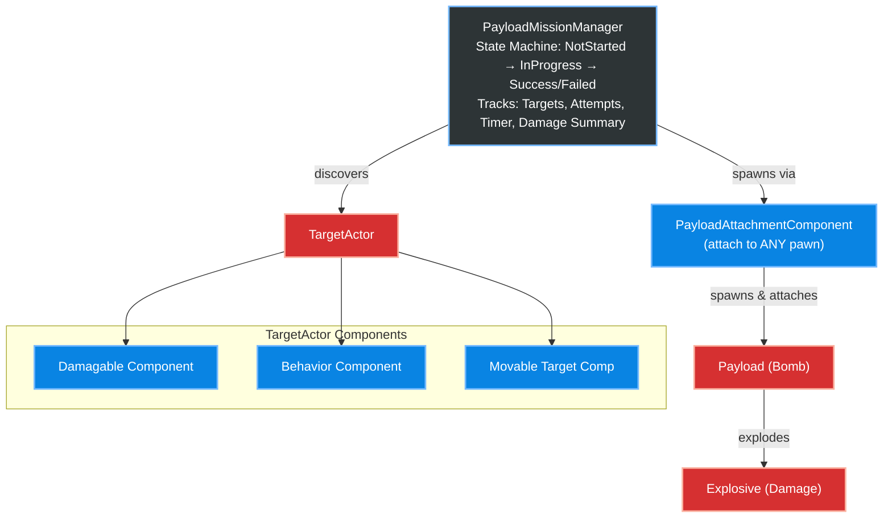

# DynamicPayloadSystem — Unreal Engine 5 Plugin

A modular C++ plugin for **payload delivery, radial damage, AI convoy movement, and mission management** in Unreal Engine 5.

Built for drone simulations, aerial strike games, and any project that needs physics-based bombing, AI vehicle convoys, and timed objective missions.

---

## Features

### Explosion & Damage System
- **Radial damage** with configurable inner/outer falloff radii (SI units — meters)
- **Closest-point damage calculation** — uses `GetClosestPointOnCollision` instead of actor-origin distance, so large targets (bunkers, buildings) receive accurate damage even when explosions detonate on their surface
- **Line-of-Sight occlusion** — targets behind cover receive 30% reduced damage via raycasts
- **Directional shrapnel** — Dot Product-based damage multiplier for targets in the forward hemisphere
- **Physics impulses** — `AddRadialImpulse` on all physics bodies in the blast radius
- **Niagara VFX + Sound** — assign any Niagara System and SoundBase on the Blueprint
- **Camera Shake** — two options:
  - **Zero-code:** Assign a `CameraShake` class on the Explosive Blueprint — triggers automatically via `PlayWorldCameraShake`
  - **Advanced:** Subscribe to the `OnExplosionTriggered` delegate for custom multi-camera/VR logic

### Payload System
- **Drop-and-detonate payloads** with configurable fuse timers
- **Dynamic hit detection** — armed payloads explode on impact with damageable targets
- **Dangling physics mode** — payloads swing as a physics pendulum via `UPhysicsConstraintComponent` (ball-joint)
- **Kinematic attach mode** — payloads attach rigidly as children (no physics overhead)
- **Kamikaze mode** — owner actor explodes payload on collision with damageable target (configurable trigger mesh and minimum speed threshold)
- **Velocity transfer** on detach — payload inherits owner velocity

### AI Target Movement
- **Spline Patrol** — follow any `USplineComponent` with smooth arc-steering entry
- **Area Patrol** — patrol randomly within a `PatrolAreaVolume` with realistic constant-arc turning (configurable `MinTurningRadius`)
- **Convoy Follow** — chain multiple vehicles to follow a leader with proportional-control distance maintenance, auto-chaining of duplicate followers, and forward collision avoidance raycasts
- **Ground Alignment** — 4-point terrain raycasts for smooth pitch/roll alignment on slopes (auto-caches mesh bounds)
- **Orbit timeout detection** — automatically abandons unreachable waypoints

### Mission Manager
- **Timed missions** with configurable duration, countdown, and attempt limits
- **Target tracking** — auto-discovers `ATargetActor` instances with `bIsMissionTarget = true`
- **State machine** — `NotStarted → InProgress → Success/Failed` with Blueprint-assignable delegates
- **Last-payload-in-flight logic** — correctly handles the edge case where the timer expires but a payload is still airborne
- **Mission summary** — tracks total damage inflicted and targets destroyed
- **Retry system** — full state reset with `RetryMission()`
- **Custom Depth glow** — automatically enables/disables `CustomDepthStencil` on mission targets

---

## Quick Start

### 1. Enable the Plugin
Copy the `Plugins/DynamicPayloadSystem` folder into your project's `Plugins/` directory. Restart the editor.

### 2. Create a Target
1. Place an `ATargetActor` in your level (or create a Blueprint from it)
2. Assign meshes for **Intact**, **Damaged**, and **Destroyed** states
3. Configure `DamagableComponent` → set `MaxHealth`
4. Configure `MovableTargetComponent` → choose a `MovementMode`:
   - **PatrolSpline:** Assign a Spline actor
   - **PatrolArea:** Assign a `PatrolAreaVolume`
   - **ConvoyFollow:** Assign a `ConvoyLeader`
   - **None:** Static target

### 3. Create a Payload
1. Create a Blueprint extending `APayload`
2. Assign a static mesh (the bomb model)
3. Set `ExplosionClass` to your Explosive Blueprint

### 4. Create an Explosive
1. Create a Blueprint extending `AExplosive`
2. Assign `ExplosionVFX` (Niagara System) and `ExplosionSound`
3. Configure `ExplosionRadius_m`, `MaxDamage`, `InnerRadius_m`, `OuterRadius_m`
4. *(Optional)* Assign a `CameraShake` class for automatic screen shake

### 5. Attach to Your Pawn
1. Add `UPayloadAttachmentComponent` to your pawn (any pawn — drones, helicopters, characters)
2. Set `PayloadClass` to your Payload Blueprint
3. Call `DetachPayload()` from your input binding to drop the bomb

### 6. Set Up a Mission (Optional)
1. Place `APayloadMissionManager` in your level (one per map)
2. Enable `bMissionModeEnabled`
3. Set `MissionDuration`, `MaxAttempts`, `CountdownStartTime`
4. Bind to `OnMissionStateChanged` and `OnMissionTimeUpdated` delegates in your HUD

---

## Architecture



### Component Breakdown

| Component | Type | Purpose |
|---|---|---|
| `UDamagableComponent` | `UActorComponent` | Health tracking, structural state transitions (Intact→Damaged→Destroyed), damage events |
| `UTargetBehaviorComponent` | `UActorComponent` | Reacts to damage states — modifies movement speed/ability |
| `UMovableTargetComponent` | `USceneComponent` | AI movement: Spline Patrol, Area Patrol, Convoy Follow, Ground Alignment |
| `UPayloadAttachmentComponent` | `UActorComponent` | Attach/detach/spawn payloads, kamikaze mode, dangling physics |

### Actor Breakdown

| Actor | Purpose |
|---|---|
| `AExplosive` | Spawned by Payload — applies radial damage, physics impulse, VFX/SFX, camera shake |
| `APayload` | The bomb — fuse timer, impact detonation, spawns AExplosive |
| `ATargetActor` | Pre-built target with mesh swapping, all components pre-attached |
| `APatrolAreaVolume` | Box volume for random patrol waypoints |
| `APayloadMissionManager` | Mission state machine — timer, attempts, target tracking |

---

## Delegates / Events

### AExplosive
```cpp
// Fires when the explosion detonates
UPROPERTY(BlueprintAssignable)
FOnExplosionTriggered OnExplosionTriggered;
// Parameters: FVector ExplosionLocation, float ExplosionRadius
```

### UPayloadAttachmentComponent
```cpp
// Fires when payload is attached or detached
UPROPERTY(BlueprintAssignable)
FOnPayloadStateChanged OnPayloadStateChanged;
// Parameters: bool bPayloadAttached
```

### APayloadMissionManager
```cpp
UPROPERTY(BlueprintAssignable)
FOnMissionStateChanged OnMissionStateChanged;
// Parameters: EPayloadMissionState NewState

UPROPERTY(BlueprintAssignable)
FOnMissionTimeUpdated OnMissionTimeUpdated;
// Parameters: float RemainingTime

UPROPERTY(BlueprintAssignable)
FOnMissionResolved OnMissionResolved;
// Parameters: EPayloadMissionState FinalState, int32 InitialTargets,
//             int32 TargetsDestroyed, float TotalDamage
// Fires once when the mission ends — bind in your results screen.
```

### IMissionLogReceiver (HUD log dispatch)

The mission manager dispatches log entries via a Blueprint-callable interface
instead of string-keyed reflection. To receive logs in your HUD:

**C++:**
```cpp
class AMyHUD : public AHUD, public IMissionLogReceiver
{
    GENERATED_BODY()
public:
    virtual void PushGameLog_Implementation(const FGameLogEntry& Entry) override;
};
```

**Blueprint:** Class Settings → Interfaces → Add `MissionLogReceiver`, then
override the `Push Game Log` event.

Logs emitted before a HUD exists are queued and flushed on first delivery.
If the active HUD class doesn't implement the interface, logs are dropped
with a one-time warning (editor only).

### UDamagableComponent
```cpp
UPROPERTY(BlueprintAssignable)
FOnStructuralStateChanged OnStructuralStateChanged;
// Parameters: EStructuralState NewState

UPROPERTY(BlueprintAssignable)
FOnDamageTaken OnDamageTaken;
// Parameters: float DamageAmount, float RemainingHealth
```

---

## Physics Compatibility

This plugin is designed for **standard Unreal Engine Chaos Physics**. All mass, impulse, and constraint handling uses native UE5 APIs:

- Payload attachment uses `UPhysicsConstraintComponent` (dangling mode) or kinematic attachment
- Explosions use `AddRadialImpulse` and `ApplyDamage`
- No custom physics engines or external dependencies required

---

## Module Dependencies

```
Core, CoreUObject, Engine, Niagara, PhysicsCore
```

---

## License

MIT License — free for personal and commercial use.
