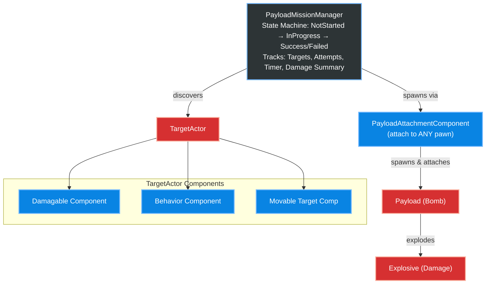

# DynamicPayloadSystem — Unreal Engine 5 Plugin

A modular C++ plugin for **payload delivery, radial damage, AI convoy movement, and mission management** in Unreal Engine 5.

Built for drone simulations, aerial strike games, and any project that needs physics-based bombing, AI vehicle convoys, and timed objective missions.

---

## Features

### Explosion & Damage System
- **Radial damage** with configurable inner/outer falloff radii (SI units — meters)
- **Closest-point damage calculation** — uses `GetClosestPointOnCollision` instead of actor-origin distance, so large targets (bunkers, buildings) receive accurate damage even when explosions detonate on their surface
- **Line-of-Sight occlusion** — targets behind cover receive 30% reduced damage via raycasts
- **Directional shrapnel** — Dot Product-based damage multiplier for targets in the forward hemisphere
- **Physics impulses** — `AddRadialImpulse` on all physics bodies in the blast radius
- **Niagara VFX + Sound** — assign any Niagara System and SoundBase on the Blueprint
- **Camera Shake** — two options:
  - **Zero-code:** Assign a `CameraShake` class on the Explosive Blueprint — triggers automatically via `PlayWorldCameraShake`
  - **Advanced:** Subscribe to the `OnExplosionTriggered` delegate for custom multi-camera/VR logic

### Payload System
- **Drop-and-detonate payloads** with configurable fuse timers
- **Dynamic hit detection** — armed payloads explode on impact with damageable targets
- **Dangling physics mode** — payloads swing as a physics pendulum via `UPhysicsConstraintComponent` (ball-joint)
- **Kinematic attach mode** — payloads attach rigidly as children (no physics overhead)
- **Kamikaze mode** — owner actor explodes payload on collision with damageable target (configurable trigger mesh and minimum speed threshold)
- **Velocity transfer** on detach — payload inherits owner velocity

### AI Target Movement
- **Spline Patrol** — follow any `USplineComponent` with smooth arc-steering entry
- **Area Patrol** — patrol randomly within a `PatrolAreaVolume` with realistic constant-arc turning (configurable `MinTurningRadius`)
- **Convoy Follow** — chain multiple vehicles to follow a leader with proportional-control distance maintenance, auto-chaining of duplicate followers, and forward collision avoidance raycasts
- **Ground Alignment** — 4-point terrain raycasts for smooth pitch/roll alignment on slopes (auto-caches mesh bounds)
- **Orbit timeout detection** — automatically abandons unreachable waypoints

### Mission Manager
- **Timed missions** with configurable duration, countdown, and attempt limits
- **Target tracking** — auto-discovers `ATargetActor` instances with `bIsMissionTarget = true`
- **State machine** — `NotStarted → InProgress → Success/Failed` with Blueprint-assignable delegates
- **Last-payload-in-flight logic** — correctly handles the edge case where the timer expires but a payload is still airborne
- **Mission summary** — tracks total damage inflicted and targets destroyed
- **Retry system** — full state reset with `RetryMission()`
- **Custom Depth glow** — automatically enables/disables `CustomDepthStencil` on mission targets

---

## Quick Start

### 1. Enable the Plugin
Copy the `Plugins/DynamicPayloadSystem` folder into your project's `Plugins/` directory. Restart the editor.

### 2. Create a Target
1. Place an `ATargetActor` in your level (or create a Blueprint from it)
2. Assign meshes for **Intact**, **Damaged**, and **Destroyed** states
3. Configure `DamagableComponent` → set `MaxHealth`
4. Configure `MovableTargetComponent` → choose a `MovementMode`:
   - **PatrolSpline:** Assign a Spline actor
   - **PatrolArea:** Assign a `PatrolAreaVolume`
   - **ConvoyFollow:** Assign a `ConvoyLeader`
   - **None:** Static target

### 3. Create a Payload
1. Create a Blueprint extending `APayload`
2. Assign a static mesh (the bomb model)
3. Set `ExplosionClass` to your Explosive Blueprint

### 4. Create an Explosive
1. Create a Blueprint extending `AExplosive`
2. Assign `ExplosionVFX` (Niagara System) and `ExplosionSound`
3. Configure `ExplosionRadius_m`, `MaxDamage`, `InnerRadius_m`, `OuterRadius_m`
4. *(Optional)* Assign a `CameraShake` class for automatic screen shake

### 5. Attach to Your Pawn
1. Add `UPayloadAttachmentComponent` to your pawn (any pawn — drones, helicopters, characters)
2. Set `PayloadClass` to your Payload Blueprint
3. Call `DetachPayload()` from your input binding to drop the bomb

### 6. Set Up a Mission (Optional)
1. Place `APayloadMissionManager` in your level (one per map)
2. Enable `bMissionModeEnabled`
3. Set `MissionDuration`, `MaxAttempts`, `CountdownStartTime`
4. Bind to `OnMissionStateChanged` and `OnMissionTimeUpdated` delegates in your HUD

---

## Architecture



### Component Breakdown

| Component | Type | Purpose |
|---|---|---|
| `UDamagableComponent` | `UActorComponent` | Health tracking, structural state transitions (Intact→Damaged→Destroyed), damage events |
| `UTargetBehaviorComponent` | `UActorComponent` | Reacts to damage states — modifies movement speed/ability |
| `UMovableTargetComponent` | `USceneComponent` | AI movement: Spline Patrol, Area Patrol, Convoy Follow, Ground Alignment |
| `UPayloadAttachmentComponent` | `UActorComponent` | Attach/detach/spawn payloads, kamikaze mode, dangling physics |

### Actor Breakdown

| Actor | Purpose |
|---|---|
| `AExplosive` | Spawned by Payload — applies radial damage, physics impulse, VFX/SFX, camera shake |
| `APayload` | The bomb — fuse timer, impact detonation, spawns AExplosive |
| `ATargetActor` | Pre-built target with mesh swapping, all components pre-attached |
| `APatrolAreaVolume` | Box volume for random patrol waypoints |
| `APayloadMissionManager` | Mission state machine — timer, attempts, target tracking |

---

## Delegates / Events

### AExplosive
```cpp
// Fires when the explosion detonates
UPROPERTY(BlueprintAssignable)
FOnExplosionTriggered OnExplosionTriggered;
// Parameters: FVector ExplosionLocation, float ExplosionRadius
```

### UPayloadAttachmentComponent
```cpp
// Fires when payload is attached or detached
UPROPERTY(BlueprintAssignable)
FOnPayloadStateChanged OnPayloadStateChanged;
// Parameters: bool bPayloadAttached
```

### APayloadMissionManager
```cpp
UPROPERTY(BlueprintAssignable)
FOnMissionStateChanged OnMissionStateChanged;
// Parameters: EPayloadMissionState NewState

UPROPERTY(BlueprintAssignable)
FOnMissionTimeUpdated OnMissionTimeUpdated;
// Parameters: float RemainingTime

UPROPERTY(BlueprintAssignable)
FOnMissionResolved OnMissionResolved;
// Parameters: EPayloadMissionState FinalState, int32 InitialTargets,
//             int32 TargetsDestroyed, float TotalDamage
// Fires once when the mission ends — bind in your results screen.
```

### IMissionLogReceiver (HUD log dispatch)

The mission manager dispatches log entries via a Blueprint-callable interface
instead of string-keyed reflection. To receive logs in your HUD:

**C++:**
```cpp
class AMyHUD : public AHUD, public IMissionLogReceiver
{
    GENERATED_BODY()
public:
    virtual void PushGameLog_Implementation(const FGameLogEntry& Entry) override;
};
```

**Blueprint:** Class Settings → Interfaces → Add `MissionLogReceiver`, then
override the `Push Game Log` event.

Logs emitted before a HUD exists are queued and flushed on first delivery.
If the active HUD class doesn't implement the interface, logs are dropped
with a one-time warning (editor only).

### UDamagableComponent
```cpp
UPROPERTY(BlueprintAssignable)
FOnStructuralStateChanged OnStructuralStateChanged;
// Parameters: EStructuralState NewState

UPROPERTY(BlueprintAssignable)
FOnDamageTaken OnDamageTaken;
// Parameters: float DamageAmount, float RemainingHealth
```

---

## Testing Guide & Demo Map

A reference demo map ships under `Content/Demos/DemoMap.umap` and exercises every public-facing feature. The walkthrough below describes both **what the demo map contains** and **how to verify each system works**. Use it for smoke-testing after upgrades, or as a starting template for your own integration.

### What the demo map contains

| Actor / Asset | Path in plugin | Purpose |
|---|---|---|
| `BP_DemoDrone` | `Content/Demos/Pawns/` | Pawn with `UPayloadAttachmentComponent`, camera, flight input |
| `BP_DemoPayload` | `Content/Demos/Payloads/` | `APayload` subclass — fuse 3s, references `BP_DemoExplosive` |
| `BP_DemoExplosive` | `Content/Demos/Explosives/` | `AExplosive` subclass — Niagara, Sound, CameraShake, 6m outer radius |
| `BP_DemoTarget` | `Content/Demos/Targets/` | `ATargetActor` subclass — Intact / Damaged / Destroyed meshes |
| `BP_DemoHUD` | `Content/Demos/HUD/` | HUD implementing `IMissionLogReceiver` — prints logs to screen |
| `BP_DemoGameMode` | `Content/Demos/` | GameMode wiring the HUD class |
| `M_Highlight` | `Content/Demos/Materials/` | Stencil-based highlight material (post-process or stencil pass) |

Place the following directly in the level:

1. **Floor / landscape** — any flat ground (UE default cube scaled, or a Landscape).
2. **`BP_DemoDrone`** — start position ~500cm above floor.
3. **3× `BP_DemoTarget`** spaced 1500cm apart, all with `bIsMissionTarget = true`.
4. **1× `APatrolAreaVolume`** sized ~3000×3000cm, plus 1× extra `BP_DemoTarget` with `MovementMode = PatrolArea`.
5. **1× Spline Actor** with 4 points, plus 1× extra `BP_DemoTarget` with `MovementMode = PatrolSpline`.
6. **2× extra `BP_DemoTarget`** with `MovementMode = ConvoyFollow` pointed at the spline target as `ConvoyLeader`.
7. **1× `APayloadMissionManager`** — `bMissionModeEnabled = true`, `MissionDuration = 60`, `MaxAttempts = 3`, `bQuitGameOnFailure = false` (so you can iterate).
8. **`BP_DemoGameMode`** assigned in World Settings.

---

### Running the tests

For each test, the **Expected** column tells you what success looks like. If you see something different, the **Troubleshooting** notes point at the most likely cause.

#### Test 1 — Damage system (no payload, just verify damage flow)

| | |
|---|---|
| **Setup** | Disable `bMissionModeEnabled` on the mission manager. Place one `AExplosive` with `bExplodeOnBeginPlay = true` ~3m from a `BP_DemoTarget`. |
| **Action** | Hit PIE. |
| **Expected** | Explosive detonates on `BeginPlay`; Niagara + sound play; target swaps to Damaged mesh after first hit, then Destroyed mesh, despawns after `DestroyDelay` seconds. |
| **Troubleshooting** | If target stays Intact, `MaxHealth` is too high vs `MaxDamage`. If VFX pops, raise `DestroyDelay_s` on the Explosive. |

#### Test 2 — Manual payload drop (kinematic mode)

| | |
|---|---|
| **Setup** | On `BP_DemoDrone` → `PayloadAttachmentComponent`: `bEnableDanglingPhysics = false`, `bAutoSpawnOnBeginPlay = true`. Disable mission mode. Bind a key (e.g. Space) to `DetachPayload()`. |
| **Action** | Fly drone over a target, press Space. |
| **Expected** | Payload spawns attached at `AttachOffset`. On release, payload falls under gravity, arms (3s fuse), impacts ground/target, spawns Explosive, target takes damage. |
| **Troubleshooting** | If payload doesn't fall, `SetSimulatePhysics(true)` may have failed — confirm `PayloadMesh` has a collision profile of `PhysicsActor`. If payload passes through target, `OwnerChannel` response wasn't restored to Block (this was the P1.6 fix — confirm latest plugin version). |

#### Test 3 — Dangling physics

| | |
|---|---|
| **Setup** | Same as Test 2 but `bEnableDanglingPhysics = true`. |
| **Action** | Fly the drone in tight turns. |
| **Expected** | Payload swings on a ball-joint constraint, dragging behind the drone. On `DetachPayload()`, constraint releases and payload inherits owner velocity (if `bTransferVelocityOnDetach = true`). |
| **Troubleshooting** | If the constraint asserts on the *second* spawn after `RetryMission()`, you're on a pre-P1.2 build — pull the latest. |

#### Test 4 — Mission start/success path

| | |
|---|---|
| **Setup** | `bMissionModeEnabled = true`, `MaxAttempts = 3`, `MissionDuration = 60`. 3 mission targets in level. |
| **Action** | PIE → wait countdown → drop payloads on all 3 targets. |
| **Expected** | Countdown logs appear via HUD. Each target highlights via custom-depth stencil. After all 3 destroyed, `OnMissionResolved` fires with `FinalState = Success`, `TargetsDestroyed = 3`. |
| **Troubleshooting** | If targets don't highlight, the HUD's post-process material isn't reading custom depth — confirm the project has a post-process volume with stencil rendering enabled, or that `M_Highlight` is set up correctly. |

#### Test 5 — Mission fail path (out of attempts)

| | |
|---|---|
| **Setup** | Same as Test 4 but `MaxAttempts = 1`. |
| **Action** | Drop one payload but **miss all targets**. |
| **Expected** | After the explosion resolves, mission enters the "last payload waiting" state. After `LastPayloadStateChangeDelay` seconds, `FailMission` fires with `Reason = "All attempts used. N targets remaining"`. |
| **Troubleshooting** | If the mission hangs in the waiting state forever, the watchdog should kick in after `LastPayloadWatchdogTimeout` seconds and force-resolve. If it doesn't, the payload pawn destroyed itself through a path that bypasses `NotifyLastPayloadResolved` — file a bug. |

#### Test 6 — Mission fail path (timeout)

| | |
|---|---|
| **Setup** | `MissionDuration = 10`, `MaxAttempts = 99` (so attempts won't run out). |
| **Action** | Sit on the spawn for the full 10 seconds. |
| **Expected** | `OnMissionTimeUpdated` ticks each second. At 0, `FailMission(TEXT("Time expired"))` fires; if `bQuitGameOnFailure = true`, the game console-quits after `QuitDelaySeconds`. |

#### Test 7 — Retry path

| | |
|---|---|
| **Setup** | After a fail in Test 5 or 6, bind a key to call `RetryMission()` on the manager. |
| **Action** | Press the retry key. |
| **Expected** | All timers cleared; mission state resets to `NotStarted`; countdown re-fires; targets re-highlighted; payload re-spawns. **Critically:** no constraint-name assert (this is what P1.2 fixed). |

#### Test 8 — AI movement (spline / area / convoy)

| | |
|---|---|
| **Setup** | The PatrolSpline, PatrolArea, and Convoy targets set up in the demo map. |
| **Action** | Watch the targets without engaging. |
| **Expected** | Spline target moves smoothly along the spline. PatrolArea target picks random waypoints inside the volume and does realistic constant-arc turns. The two convoy followers chain behind the spline target with `FollowDistance` spacing. Ground-aligned pitch/roll on slopes. |
| **Troubleshooting** | If the convoy follower jitters or stalls, `ConvoyFollowStiffness` is too high — drop it to 1.0. If targets sink into the ground, raise `GroundOffset`. |

#### Test 9 — Kamikaze mode

| | |
|---|---|
| **Setup** | On `BP_DemoDrone` → `PayloadAttachmentComponent`: `bKamikazeMode = true`, `KamikazeTriggerMeshName = "CopperPin"` (or whatever child mesh name you used), `MinKamikazeSpeed_ms = 5`. Add a child static-mesh component to the drone Blueprint named exactly `CopperPin`. |
| **Action** | Fly into a target at speed > 5 m/s. |
| **Expected** | On overlap with a damageable target moving fast enough, `NotifyKamikazeTriggered` fires, the payload explodes at the trigger mesh location, the drone is destroyed. |
| **Troubleshooting** | If nothing happens at low speed, that's correct — the `MinKamikazeSpeed_ms` gate. If the drone-on-drone collision triggers it, raise `MinKamikazeSpeed_ms` or filter via `bIsMissionTarget`. |

#### Test 10 — Late-spawned mission target

| | |
|---|---|
| **Setup** | In `BP_DemoGameMode`, add a `Set Timer by Function Name` that spawns a `BP_DemoTarget` (with `bIsMissionTarget = true`) **15 seconds after `BeginPlay`**. |
| **Action** | Run the mission; wait until after the 15-second mark. |
| **Expected** | New target appears, highlights immediately, and counts toward the win condition. The mission only succeeds when this target *and* the originally-placed ones are all destroyed. (This is what P1.4 enabled — late-spawn registration.) |

#### Test 11 — HUD log integration

| | |
|---|---|
| **Setup** | `BP_DemoHUD` implements `IMissionLogReceiver`. In the `PushGameLog` event, call `Print String` with the log message. Set `BP_DemoHUD` as the HUDClass in `BP_DemoGameMode`. |
| **Action** | Run a full mission. |
| **Expected** | Each mission event prints to screen — "Mission Started", "Attempt consumed. Remaining: N", "Mission Successful", etc. Logs emitted before the HUD existed are also delivered when the HUD comes online (this is what P1.3 and the post-P1.3 re-analysis fix guarantee). |
| **Troubleshooting** | If you see the editor warning `"HUD '<class>' does not implement IMissionLogReceiver"`, your HUD class isn't tagged with the interface — open Class Settings → Interfaces and add `MissionLogReceiver`. |

---

### Migrating the demo map into the plugin

After you've built the demo map in your test project, ship it with the plugin so other users get the same starting point.

1. **Right-click `Content/Demos/DemoMap` in the test project** → Asset Actions → Migrate.
2. UE walks the dependency tree and shows everything the map references (textures, meshes, materials, the BP classes).
3. **Set destination** to `D:/UE_5.7/Engine/Plugins/Marketplace/DynamicPayloadSystem/Content/Demos/`.
4. UE copies all dependencies and rewrites references to the plugin paths.
5. Verify by opening a *new* project, enabling the plugin, and opening `/DynamicPayloadSystem/Demos/DemoMap` from the Content Browser.

**Important:** anything migrated into the plugin's `Content/` becomes part of the FAB submission. Don't migrate engine-bundled or third-party-bundled assets — strip them out before migration (use cleaner pass: `File → Migrate` lets you exclude branches of the dependency tree).

---

## Physics Compatibility

This plugin is designed for **standard Unreal Engine Chaos Physics**. All mass, impulse, and constraint handling uses native UE5 APIs:

- Payload attachment uses `UPhysicsConstraintComponent` (dangling mode) or kinematic attachment
- Explosions use `AddRadialImpulse` and `ApplyDamage`
- No custom physics engines or external dependencies required

---

## Module Dependencies

```
Core, CoreUObject, Engine, Niagara, PhysicsCore
```

---

## License

MIT License — free for personal and commercial use.
